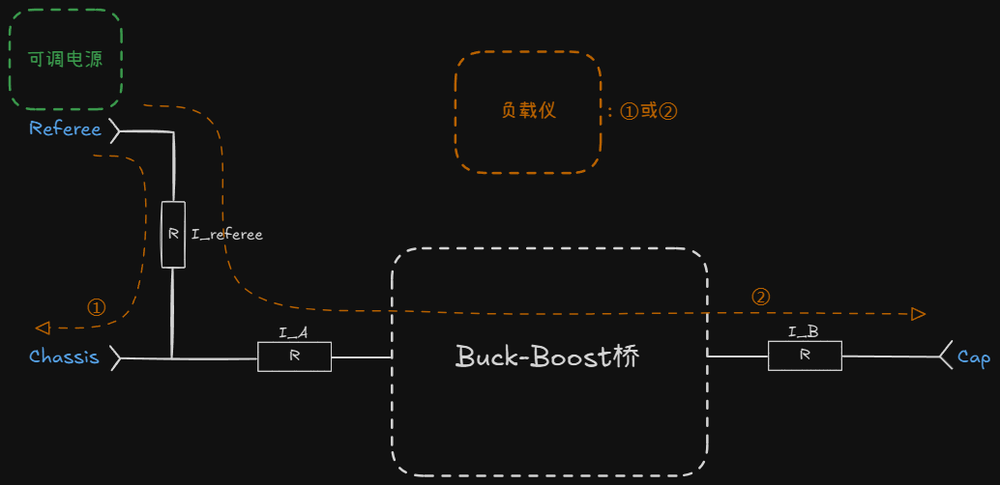
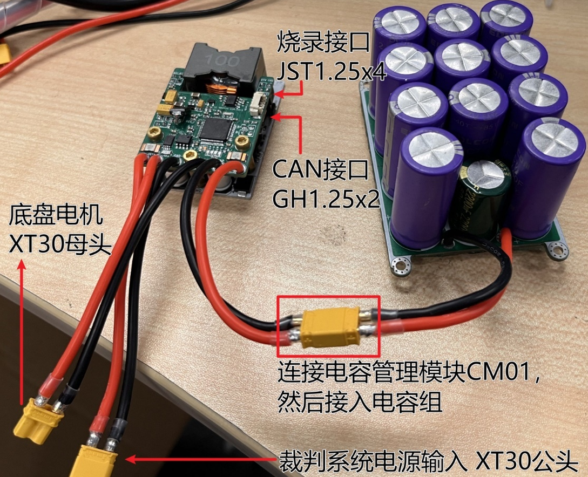
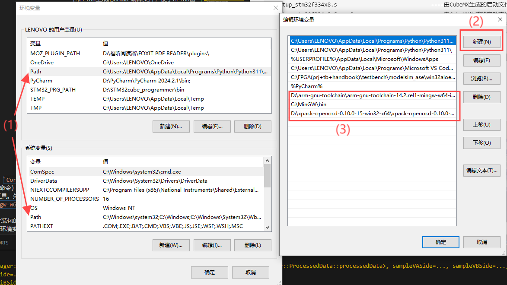
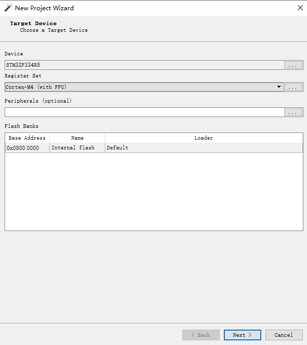
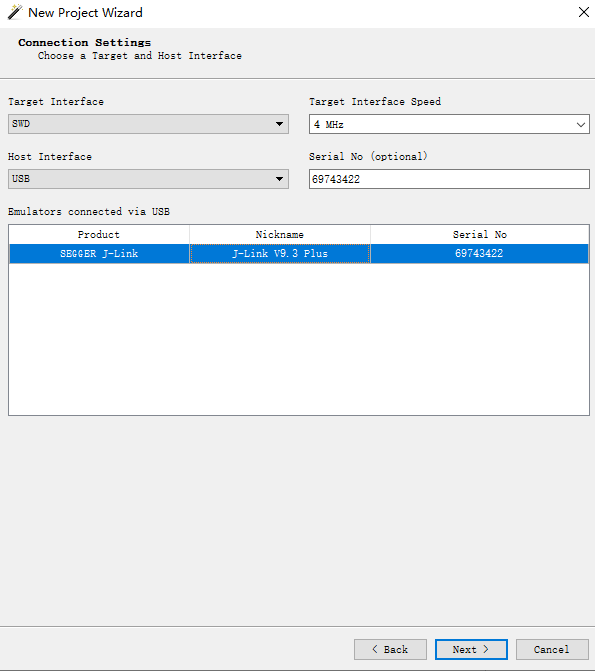
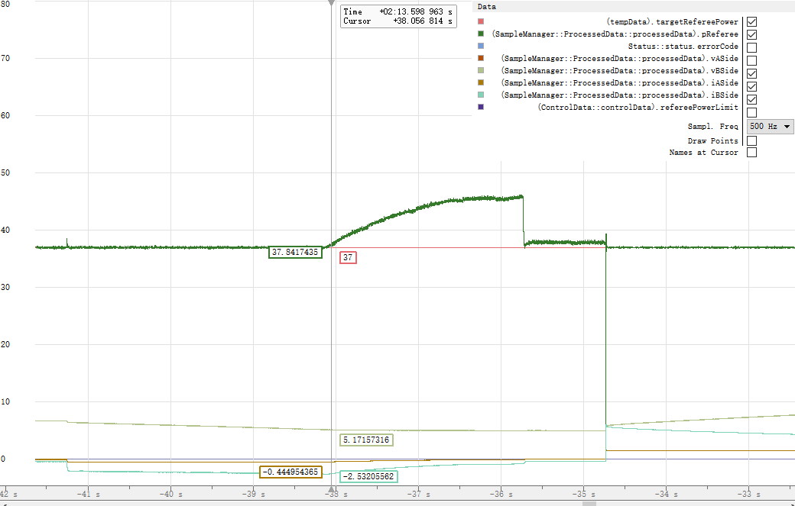
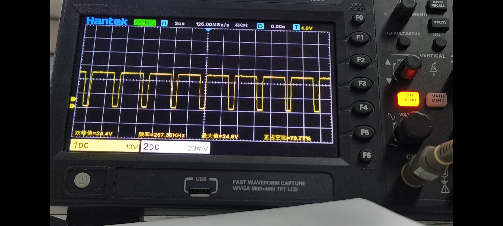
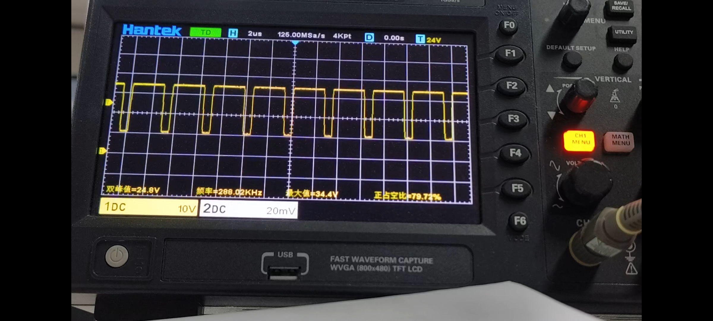
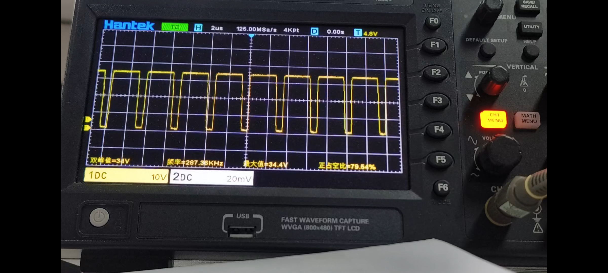
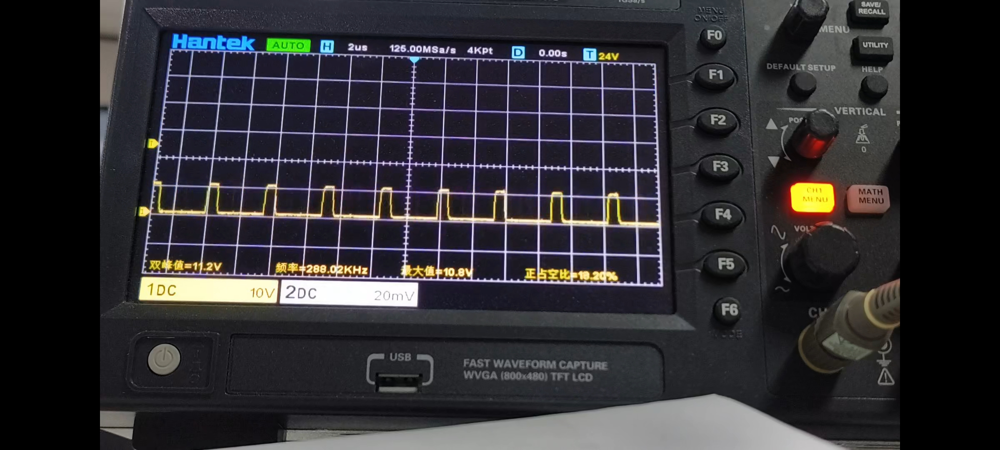

# GKD超级电容控制器方案

- 致谢开源队伍：香港科技大学ENTERPRIZE战队

>制作调试：聂亦飞 于泽源
>
>此文档撰写：于泽源

## 历代超电

RM2024方案-->[这里](https://github.com/GKD-RM-Lab/RM_supercap-control-module)

## 文件结构

```text
Calibration/cal.xlsx                              ----校准用Excel工具表
Core                                              ----核心代码文件
Docs                                              ----文档附图源码
Drivers                                           ----STM32驱动文件
hardware                                          ----硬件项目文件
      --    SuperCap2024_Control_V1.1R_F3_ISOPWR  ----控制板Kicad项目文件
      --    SuperCap2024_Power_V1.2R              ----功率板Kicad项目文件
CMakeLists.txt                                    ----由CLion生成的CMake编译文件，便于CLion创建项目
flash.sh                                          ----Shell脚本文件，内容其实就是Shell命令，可以用bash解释器运行
Makefile                                          ----由CubeMX生成的MakeFile编译文件
```

## 使用方法

### 步骤

1. 硬件准备。很重要，若复现时出问题大概率是硬件问题，检查焊接、器件型号等。因为方案已经过验证基本没有问题。（注意：控制板背面R16 R19要手工焊接，否则采样路径断路；正面C35 C48留空为正常）
2. 代码跑起来。先用电脑USB供电即可，能够成功下载程序，指示灯、蜂鸣器提示正常。打开CALIBRATION_MODE进行烧录才能修改HARDWARE_ID，烧录后重新拔插供电即可。
3. 检查系统供电。接24V供电，检查24V --> 10.2V -->3.3V。确保供电正常且稳定。
4. 校准。通过宏定义`CALIBRATION_MODE`开启/关闭校准模式。先校准电压，再用负载仪恒流模式校准电流。校准电流时，先校准IReferee，此时在PowerManager.cpp中手动关闭输出，较为准确；然后再手动打开输出，校准IA IB。确保各项电流、电压采样正常，否则不要上功率和电容组。
   
   一个超电系统对应一个HARDWARE_ID。
5. 上功率调试。先用可调电源和负载仪恒压模式调电流环，再用恒功率模式测试功率环。若确定硬件没什么问题，直接用恒功率模式测试也问题不大。
6. 通信测试。与上位机CAN通信，通过上位机设置限制功率、上位机接收超电反馈底盘功率等。
7. 装车！(如果需要的话，取消宏定义IGNORE_CAPACITOR_ERROR)

- 一定小心电容组不要以任何形式短接！！否则超级电容瞬间变电焊
- （有一次想测量电容组剩余电压，不小心两个表笔碰了一下，笔尖瞬间无了。。

### 硬件接口&连接



### 软件环境&编译&烧录

本项目基于GCC ARM GNU工具链。

#### 方法一

VScode + STLink

- 优点：VScode好用；STLink便宜
- 缺点：配置麻烦；openocd调试不支持监视变量实时刷新(在这个项目里比较致命，这也是我后来放弃它的原因)

1. 在VSCode中安装所需插件。（1）`Cortex-Debug`（主要）；（2）`CMake`；（3）`Start git-bash`（使得你可以在VSCode终端中使用bash命令）。以上插件直接在VSCode中搜索下载即可。
2. 配置Windows环境下编译ARM的工具。先下载工具链`arm-none-eabi-gcc`(具体是下载`arm-gnu-toolchain-1x.x.rel1-mingw-w64-i686-arm-none-eabi.zip`即可)，解压后将bin文件夹的路径添加到环境变量（见下图）。
3. 安装GCC环境。下载`MinGW`，安装包的时候安装第2，5，7个包（建议安装在C盘，安装在其他盘遇到过识别不到的神秘情况），并添加bin路径的环境变量（见下图）。最后，将`mingw32-make.exe`改为`make.exe`，重启电脑，之后在终端中使用`-v`命令检测前面的工具链和后面的`MinGW`是否安装完毕。
4. 安装调试器openOCD。在[这里](https://github.com/xpack-dev-tools/openocd-xpack/releases)下载`0.10.0-15`版本（一定要是10版本，12版本对于`stm32f334r8t6`有bug）的openOCD，解压缩，并将bin文件路径添加到系统变量：

1. 然后即可执行编译操作。
   需要注意编译时需要指定HARDWARE_ID，否则将会报错：
  
   ```bash
   make -j HARDWARE_ID=xxx
   ```

   得到`build/`目录下`RM2024-SuperCap-F3-V1R.elf`文件即为编译成功。
   接着使用此命令进行烧录：

   ```bash
   openocd -f interface/stlink.cfg -f target/stm32f3x.cfg -c "init" -c "halt" -c "program build/RM2024-SuperCap-F3-V1R.bin 0x08000000 verify" -c "reset run" -c "exit"`
   ```

- 或者可以将编译和烧录命令写入.sh文件，每次只需使用命令以下即可！

```bash
bash flash.sh
```

至此就可以开始调试了！

#### 方法二

Ozone(推荐) + JLink

- 推荐理由：配置简单；Ozone调试器支持监视变量实时刷新；自带变量可视化绘图功能

1. 安装GCC环境。同方法一。(也可选择MSYS2等，自行学习)
2. 安装`arm-none-eabi-gcc`
   然后即可执行编译操作。需要注意编译时需要指定HARDWARE_ID，否则将会报错。

   ```bash
   make -j8 HARDWARE_ID=xxx
   ```

   得到`build/`目录下`RM2024-SuperCap-F3-V1R.elf`文件即为编译成功。
   将elf文件在ozone新建项目中打开，即可通过JLink烧录至MCU中。

   
   

## 调试问题

1. ERROR-BUCK-BOOST。
2. 系统反复重启。debug方法：首先，考虑可能是上电瞬间电流过大导致可调电源瞬间限流，导致系统反复重启；用示波器查看24V发现有万用表无法察觉的瞬间跳变，使用DJI航空电池供电，不再反复重启，回到ERROR-SHORT-CIRCUIT。
3. ERROR-SHORT-CIRCUIT。

## 现象说明

- 正常模式下，只接超电模组不会使系统工作也不会打开输出；但调试模式下会。
- 电容组放电至低于5V时，功率限制失效？-->电容组输出电流在`updateVIP()`中受到`CAP_V_CUTOFF`限制，限制到`MIN_CAP_IOUT = 0.1f`

## 相关波形

### UCC27201引脚波形

- HS脚（SW）波形 
- HB脚（bootstrap cap）波形 
- HO脚波形 
- LO脚波形 

## 原港科大开源链接

RM2023-SuperCapacitor[这里](https://github.com/hkustenterprize/RM2023-SuperCapacitor)

RM2024-SuperCapacitorController[这里](https://github.com/hkustenterprize/RM2024-SuperCapacitorController)
